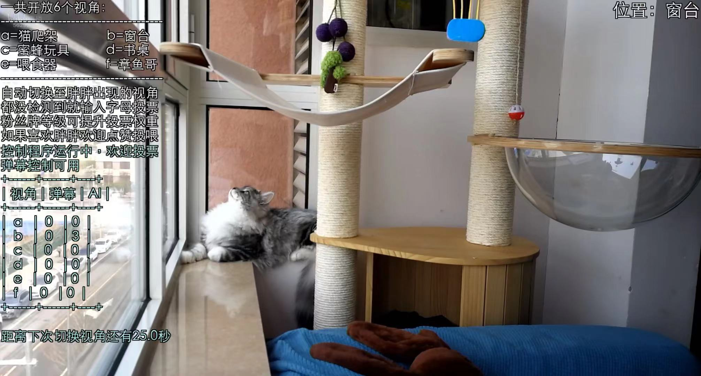
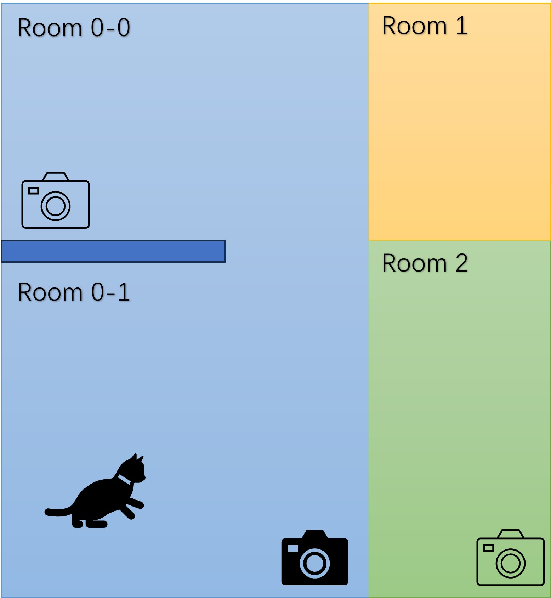
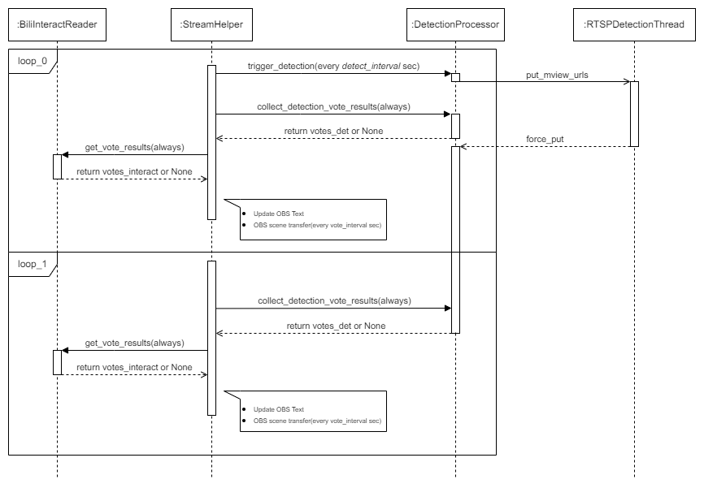

# Cat Stream

## Introduction

This project is a multi-perspective cat live streaming program implemented based on Python and OBS Studio. It can select the camera view according to the vote results. Every loop the main program controls OBS to activate a scene
with most votes.



Please set up your cameras for spots where cats often stay.



The main program initializes upon startup according to the configuration file, connects to the OBS websocket server, and enters a while loop. Within each iteration of the loop, it collects votes.
There are 2 sources of votes, one is image detector, the other is user's danmu from bilibili live platform.
- **interact_reader**: `BiliInteractReader` is a class reading interactive danmu messages from a sub-thread, converting them into number of vote. Vote weight bonus for super user and followers level is also considered here.
- **detection_proc**: `DetectionProcessor` is a class submitting valid rtsp urls to a sub-thread, fetching detection
results on rtsp newest frame. `RTSPDetectionThread` uses ffmpeg or cv2 to read the latest video frames from RTSP. Utilizing YOLOv5 or cv2, it detects whether a cat is present in the video frames.



## Prerequisites

Before you begin, ensure you have met the following requirements:

- **OBS studio**: Please configure the various scenes and RTSP media sources in OBS, and enable OBS websocket. This project merely automates the process of scene switching, not creating.
- **Pytorch**: Pytorch-CPU is required for YOLOv5 cat body detection. Without pytorch, the performance of cv2 cat face detection is relatively poor.
- **FFmpeg command tool**: To read RTSP stream, ffmpeg works perfectly, while cv2 usually reports decoding errors(the program won't crash).

## Installing

Navigate to the root directory of the project, and then directly use pip to install this project. Third-party dependencies will be automatically completed.
```bash
pip install .
```
To run the YOLO object detection with GPU, please refer to the official PyTorch tutorial and modify the device-related section in the configuration file of this project.

## Running

Please write the configuration file needed for live streaming control based on the existing configuration files and runtime environment in the `configs/` directory. For the specific meaning of each value in the configuration file, you can refer to the docstring of the `__init__` function in the code.

When the configuration file is ready, start program with a command like below:
```bash
python tools/main.py --config_path configs/default_config.py
```


## Authors

* **LazyBusyYang** - [Github Page](https://github.com/LazyBusyYang)

## License

This project is licensed under the Apache 2.0 License
